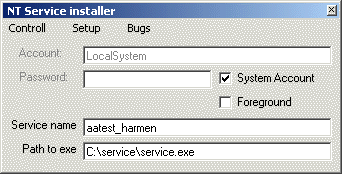

## Auto Service

### Description

This is it. This app install itself as an service and runs. All in one app. Choose between fore and background. So if a user is logged in it can interact with the user.

Specify task to run, and tasks that may NOT run.

So you can make it inpossible for the user to run notepad and force him to start eudora. And keep it open ......

Remotely controll the app via txt files. So you can open programms on demand (virus scan etc).
 
### More Info
 

             |
---                |---
**Submitted On**   |2003-05-09 09:00:22
**By**             |[Harmen](https://github.com/Planet-Source-Code/PSCIndex/blob/master/ByAuthor/harmen.md)
**Level**          |Advanced
**User Rating**    |4.6 (64 globes from 14 users)
**Compatibility**  |VB 5\.0, VB 6\.0
**Category**       |[Windows System Services](https://github.com/Planet-Source-Code/PSCIndex/blob/master/ByCategory/windows-system-services__1-35.md)
**World**          |[Visual Basic](https://github.com/Planet-Source-Code/PSCIndex/blob/master/ByWorld/visual-basic.md)
**Archive File**   |[Auto\_Servi1586335112003\.zip](https://github.com/Planet-Source-Code/harmen-auto-service__1-45373/archive/master.zip)

